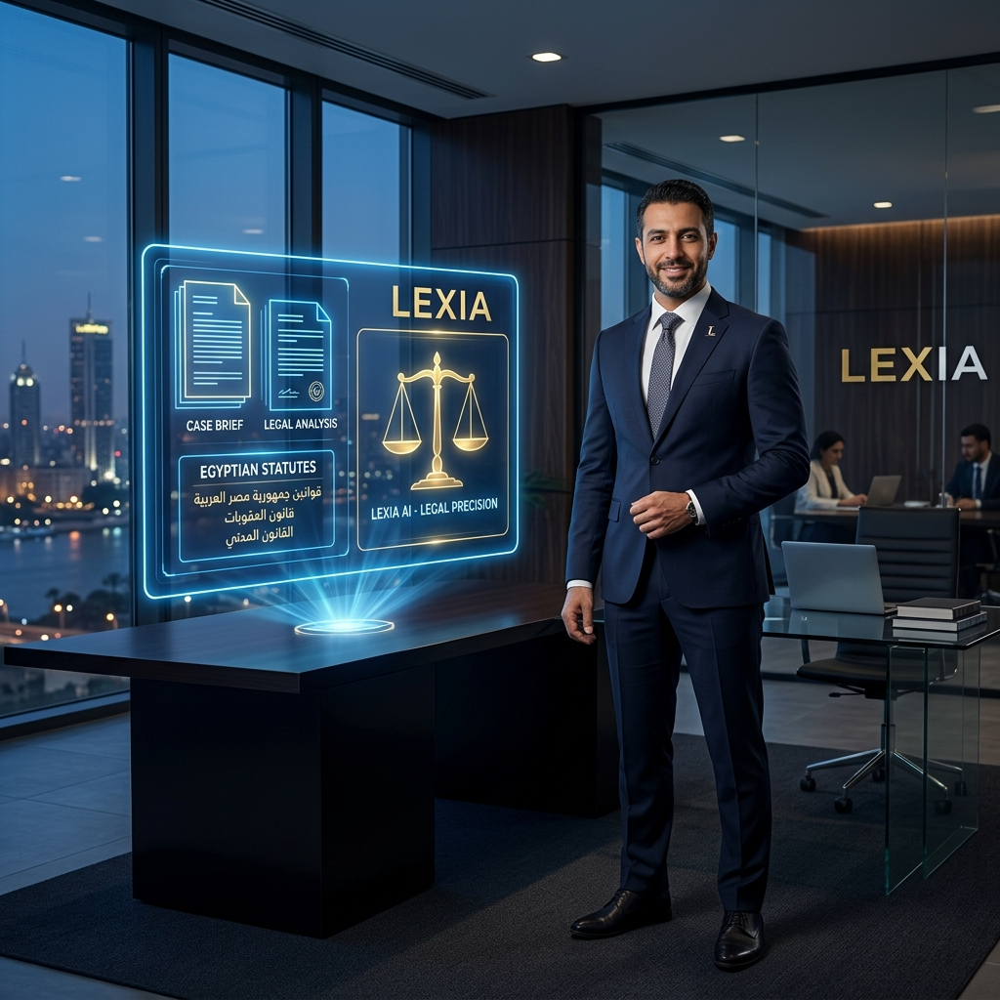
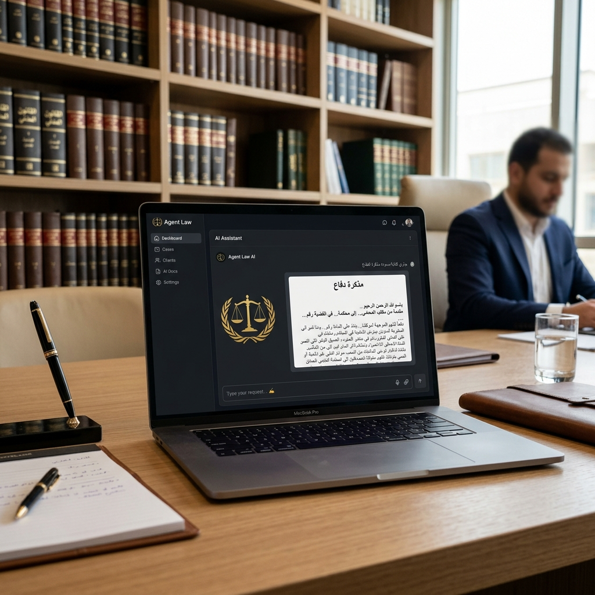

# حزمة إنتاج الفيديو الترويجي: "مشكلة وحل" لمنصة سَنَد (سَنَد | شريكك القانوني الذكي)

مرحباً بك أستاذي الكريم. لقد قمت بإعادة صياغة السيناريو بالكامل ليركز بشكل أساسي ومباشر على أسلوب **"المشكلة والحل" (Problem-Solution Framework)**، وهو الأسلوب الأنجح تسويقياً لإقناع المحامين بشراء الاشتراك. يركز الفيديو على المشاكل اليومية الحقيقية التي تواجه المحامي المصري، ثم يقدم المنصة كحل سحري وفوري لها.

---

## 📸 الأصول البصرية المرفقة (استخدمها كشاشات انتقالية أو خلفية في الفيديو)

### 1. لقطة المشكلة / بيئة العمل التقليدية (تمثيلية)
يمكنك استخدام هذه الصورة للتعبير عن التكنولوجيا والذكاء الاصطناعي كحل متكامل يدمج المظهر المهني الكلاسيكي مع التقنية الحديثة:

### 2. لقطة الحل / واجهة المنصة الذكية (Dashboard Mockup)
توضح شكل التطبيق الفعلي على لابتوب حديث بنظام مريح وسريع لصياغة المذكرات:

---

## 🎬 هيكل الفيديو الترويجي: "المشكلة والحل"

* **مدة الفيديو:** 60 ثانية (سريع، مباشر، ومناسب لمنصات التواصل الاجتماعي مثل تيك توك، ريلز، وفيسبوك).
* **اللغة:** عامية مصرية مهنية ومقنعة (نبرة صوت موثوقة وقريبة للمحامي).
* **الموسيقى المرافقة:** تبدأ بموسيقى درامية تعبر عن الضغط والتوتر، ثم تتحول فجأة لموسيقى حماسية وتقنية مريحة عند ظهور الحل.

---

### ⚖️ الجزء الأول: المشكلة (The Pain Points)
**الهدف:** جعل المحامي يشعر بالمعاناة اليومية التي يمر بها ويقول لنفسه: "فعلاً.. هذا ما يحدث معي!"

| المشهد البصري | النص المكتوب على الشاشة | التعليق الصوتي (Voiceover) |
| :--- | :--- | :--- |
| **المشهد 1 (0:00 - 0:08):** لقطة سريعة لمحامي جالس في مكتبه بالليل، يفرك جبينه بتعب، وأمامه جبل من ملفات القضايا الورقية المبعثرة وكوب قهوة فارغ. | **المشكلة 1:** الوقت الضائع في صياغة القضايا. | "كمحامي.. كم مرة راح عليك ميعاد جلسة أو سهرت للفجر عشان بتكتب مذكرة دفاع؟ ووقتك بيضيع كله في الكتابة الروتينية بدل ما تركز في كسب القضية؟" |
| **المشهد 2 (0:08 - 0:15):** لقطة مقربة لصفحات من كتب أحكام محكمة النقض الضخمة، والبحث اليدوي المتعب تحت إضاءة صفراء خافتة. | **المشكلة 2:** صعوبة الوصول للدفع القانوني المناسب وسط آلاف الأحكام. | "والأصعب.. لما تحتاج دفع قانوني حاسم أو حكم نقض معين يغير مسار القضية، وتضطر تلف في مجلدات وكتب النقض لساعات وممكن متلاقيهوش في الآخر بسبب ضيق الوقت!" |
| **المشهد 3 (0:15 - 0:20):** شاشة لابتوب قديمة يظهر فيها وورد (Word) منسق بشكل سيء، مع ظهور علامة تعجب حمراء توحي بخطأ في التنسيق أو الصياغة. | **المشكلة 3:** أخطاء التنسيق والصياغة وضياع الثغرات. | "غلطة صياغة واحدة أو دفع ناقص ممكن يخسرك القضية ويضيع مجهودك وتعب موكلك." |

---

### 🚀 الجزء الثاني: الحل (The Solution)
**الهدف:** تقديم منصة "المستشار القانوني الذكي" كمنقذ فوري يحل كل المشاكل السابقة بضغطة زر واحدة.

| المشهد البصري | النص المكتوب على الشاشة | التعليق الصوتي (Voiceover) |
| :--- | :--- | :--- |
| **المشهد 4 (0:20 - 0:30):** *(تغير فوري للموسيقى لتصبح حماسية وإيجابية)* محامي مبتسم يفتح اللابتوب وتظهر شاشة المنصة الذكية (صورة اللابتوب المرفقة). | **الحل:** منصة سَنَد (سَنَد \| شريكك القانوني الذكي). | "علشان كده عملنا لك الحل! **منصة سَنَد**. أول نظام ذكاء اصطناعي مصري مخصص للمحامين لتبسيط عملك وزيادة أرباحك." |
| **المشهد 5 (0:30 - 0:45):** لقطة شاشة متحركة (Screen Record): المحامي يرفع ملف قضية (PDF) أو يكتب ملخص الوقائع. نرى المنصة تكتب بخطوات سريعة: 1. *تحليل الوقائع...* 2. *استخراج الدفوع...* 3. *صياغة مذكرة الدفاع موثقة بالنقض.* | **الميزات:** - تحليل ذكي للمستندات. - استخراج تلقائي للدفوع. - صياغة مذكرة دفاع كاملة في ثوانٍ. | "كل اللي عليك: ارفع ملف القضية أو اكتب وقائعها. المنصة هتقرأها في ثواني، وتستخرج لك الدفوع القانونية المناسبة، وتصيغ لك مذكرة دفاع كاملة وموثقة بأحكام محكمة النقض المحدثة سحابياً." |
| **المشهد 6 (0:45 - 0:52):** المحامي يضغط على زر "تحميل المذكرة"، فتظهر شاشة طباعة منسقة بخط أميري كلاسيكي وهوامش القضاء المعتمدة، ثم يطبعها بابتسامة ثقة. | **النتيجة:** مذكرات دفاع جاهزة للتقديم بنسبة دقة 100%. | "المذكرة بتتحمل فورا بتنسيق المحاكم المصرية المعتمد وخط أميري جاهزة للطباعة والتقديم علطول. وفرت 80% من وقت البحث وضمنت جودة شغلك." |

---

### 📞 الجزء الثالث: دعوة لاتخاذ إجراء (Call to Action)
**الهدف:** دفع المحامي للتسجيل أو الشراء حالاً.

| المشهد البصري | النص المكتوب على الشاشة | التعليق الصوتي (Voiceover) |
| :--- | :--- | :--- |
| **المشهد 7 (0:52 - 1:00):** شعار المنصة الذكي (الميزان الذهبي) مع معلومات التواصل والدومين الخاص بك بشكل متحرك وأنيق. | **اشترك الآن!** ابدأ التجربة المجانية لمكتبك اليوم. [رابط الموقع / رقم الواتساب] | "انقل مكتبك لعصر الذكاء الاصطناعي ووفر مجهودك. اشترك النهاردة في منصة سَنَد وكن سابقاً بخطوة! تواصل معنا فوراً لتفعيل حسابك." |

---

## 💡 نصائح وحيل لإنتاج هذا الفيديو لجذب العملاء:

1. **تصوير تسجيل شاشة حقيقي (Screen Recording):**
   * أهم جزء بيعي هو إثبات أن المنصة تعمل فعلاً وتنتج نتائج مذهلة. 
   * سجل لقطة شاشة مدتها 10 ثوانٍ وأنت تكتب قضية حقيقية وتضغط إرسال، ثم أظهر سرعة استجابة المساعد القانوني والخطوات التي يقوم بها (جاري قراءة وقائع الدعوى... جاري استخراج الدفوع...). هذا الجزء يسمى تسويقياً بالـ **"Magic Moment"** وهو الذي يدفع العميل للشراء.
2. **صوت المعلق (Voiceover):**
   * إذا كنت ستسجل صوتك، استخدم نبرة هادئة وجادة في النصف الأول (المشكلة)، ونبرة متفائلة وقوية في النصف الثاني (الحل).
   * إذا أردت صوتاً احترافياً بالذكاء الاصطناعي، يمكنك استخدام **ElevenLabs** (فهو يدعم العامية المصرية بشكل ممتاز وبأصوات تبدو بشرية تماماً).
3. **تطبيق كاب كات (CapCut):**
   * ارفع الصور المرفقة بالأعلى، وأضف تسجيل الشاشة الخاص بالمنصة، وركب عليها الصوت والموسيقى. استخدم ميزة "Auto Captions" لكتابة النصوص تلقائياً على الفيديو لجذب المشاهدين الذين يشاهدون بدون صوت.
